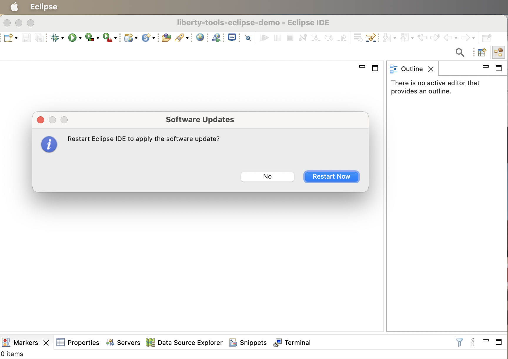

# Installation guide

## Prerequisites
See the [user guide](user-guide.md#before-you-begin) for install requirements

## Installation options
You can install Liberty Tools as new software by one of the following methods:

*  Using the Eclipse Marketplace
*  Configuring an update site
*  Downloading the artifacts and installing them by using the archive 

## Using Eclipse Marketplace

1. Point your browser to the Liberty Tools marketplace entry: https://marketplace.eclipse.org/content/liberty-tools
2. Drag the **Install** button to the toolbar of your Eclipse IDE

## Using the Eclipse Marketplace client

1. From the menu bar in your IDE, select **Help** > **Eclipse Marketplace** and type **"Liberty Tools"** and then <kbd>Enter</kbd>.

2. Locate the **Liberty Tools <*version*>** entry and click the **Install** button.

    **NOTE:** Do NOT be confused and select to install the "IBM Liberty Developer Tools" entry.  This is an earlier, different set of IDE features/plugins, though with the similar name.

## Using Help -> Install New Software

You can use the **Install New Software** option in the Eclipse **Help** menu to install Liberty Tools by using an update site or through an archive.

1. From the menu bar in your IDE, select **Help** > **Install New Software**.

2. For any release in the [Releases](https://github.com/OpenLiberty/liberty-tools-eclipse/releases) list, you can add the installation artifacts either from an update site or from a downloadable archive. The entry for each release page includes the URLs for both options.
    
    a. Install by using an update site URL. 

    Find the update site URL for your chosen release from the entry in the Releases list. For example, the URL for the [24.0.9 release](https://github.com/OpenLiberty/liberty-tools-eclipse/releases/tag/liberty-tools-24.0.9.202409170137) is https://public.dhe.ibm.com/ibmdl/export/pub/software/openliberty/liberty-tools-eclipse/24.0.9/repository/.

    Click the **Add...** button to open the **Add Repository** view. Copy and paste the update site URL as the **Location**, specify a **Name** of your choice (optional), and click the **Add** button.

    
 
    b. Install by using an archive site URL.

    Find the URL for the archive zip for your chosen release from the entry in the Releases list. For example, the URL for the 24.0.9 release is https://public.dhe.ibm.com/ibmdl/export/pub/software/openliberty/liberty-tools-eclipse/24.0.9/repository.zip

    Download this zip to your local workstation and copy the path to the downloaded archive.

    Click on the **Add...** button to open the **Add Repository** view. Specify a **Name** of your choice (optional), and click the **Add** button. paste the location of the downloaded archive, and click the **Add** button.

    

3. Select the **Liberty Tools** software and click **Next**.

4. Review the installation details and click **Next**.

5. Review and accept the license agreement and click **Finish**.

6. Trust - Depending on your original IDE package, you might be required to accept trust of one or more open source packages serving as prerequisites of Liberty Tools.

7. Restart Eclipse at the prompt.

### Next steps

For detailed information about using Liberty Tools, see the [User Guide](user-guide.md#before-you-begin).
