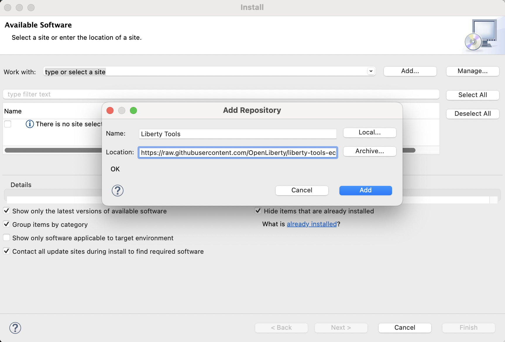
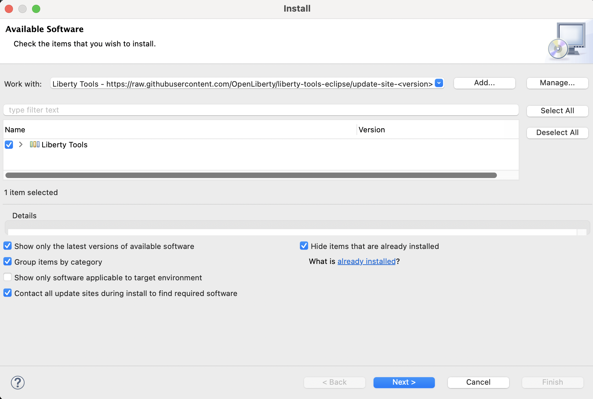

# Install Guide

## Prerequisites
See [here](user-guide.md#before-you-begin) for install requirements

## Install Options
The Liberty Tools feature can be installed as new software either by:

*  using the Eclipse Marketplace, OR
*  configuring an update site, OR
*  downloading the artifacts and installing using the archive

## Using Eclipse Marketplace

1. Point your browser to the Liberty Tools marketplace entry: https://marketplace.eclipse.org/content/liberty-tools
2. Drag the "Install" button to the toolbar of your Eclipse IDE

## Using Eclipse Marketplace client

1. Go to menu:  `Help`->`Eclipse Marketplace` and type **"Liberty Tools"**.

    **NOTE:** Do NOT select the "IBM Liberty Developer Tools" selection, which is an earlier, different set of IDE features/plugins, though with the similar name.

## Using Help -> Install New Software

The Liberty Tools feature can be installed using the artifacts provided in the form of an update site or through an archive.

1. Go to menu: `Help`->`Install New Software`.

2. For a given release selected from the [Releases](https://github.com/OpenLiberty/liberty-tools-eclipse/releases) list, the installation artifacts can be added in one of two ways (the specific release page shows the URLs for each):
    
    a. **UPDATE SITE** 

    Find the update site URL.  E.g. for the [0.7.0 release](https://github.com/OpenLiberty/liberty-tools-eclipse/releases/tag/liberty-tools-0.7.0.202212141445), the URL would be: https://public.dhe.ibm.com/ibmdl/export/pub/software/openliberty/liberty-tools-eclipse/0.7.0/repository/

    Click on the `Add...` button to open the `Add Repository` view. Specify a name, copy/paste the URL above as the location, and click on the `Add` button. 

    
 
    b. **ARCHIVE** 

    Find the URL for the archive zip. E.g. for the 0.7.0 release, the URL would be: https://public.dhe.ibm.com/ibmdl/export/pub/software/openliberty/liberty-tools-eclipse/0.7.0/repository.zip

    Download this zip to your local workstation and copy the path to the downloaded archive.

    Click on the `Add...` button to open the `Add Repository` view. Specify a name, paste the location of the downloaded archive, and click on the `Add` button. 

    

3. Select the Liberty tools software and click `Next`.

4. Review the installation details and click `Next`.

5. Review/Accept the License agreement and click `Finish`.

6. Trust - Depending on your original IDE package you may be required to accept trust of **org.apache.commons3.lang**, a prerequisite of the LSP4Jakarta component used by Liberty Tools.

7. Restart Eclipse at the prompt.

### Next steps

See: [User Guide](../user-guide.md)
