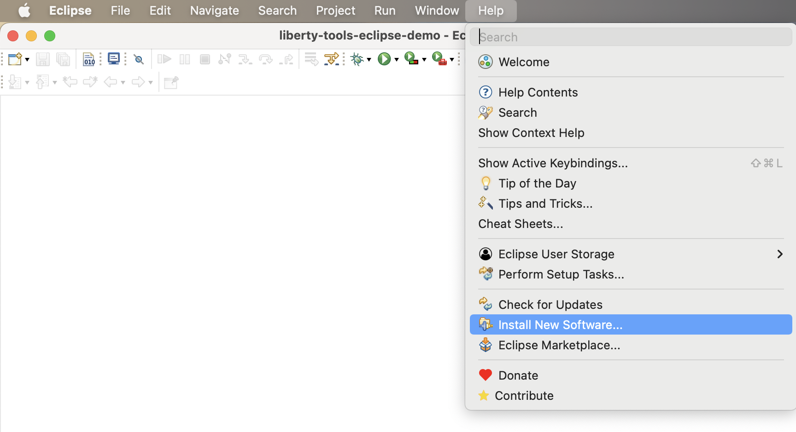
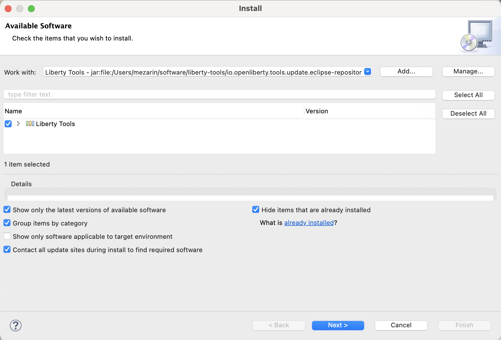

# Installation

The Open Liberty tools for Eclipse plugin can be installed as new software by using the artifacts provided in the form of an update site or through an archive.

1. Go to menu: `Help`->`Install New Software`.

2. Add the location containing the plugin's installation artifacts. This can be done in two ways:

- Using an update site. The update site (`update-site-<version>`) is provided as a [branch on Open Liberty Tools for eclipse git repository](https://github.com/OpenLiberty/liberty-tools-eclipse/branches). Select the version you would like to install and copy a link to the branch.

Click on the `Add...` button to open the `Add Repository` view. Specify a name, paste the copied link as the location, and click on the `Add` button. 

 
 Select the Liberty tools software and click `Next`.

- Using an archive. The archive is provided as an asset on the [Open Liberty tools for Eclipse releases page](https://github.com/OpenLiberty/liberty-tools-eclipse/releases). Select the version you would like to install, download the installation archive to your local workstation, and copy the path to the downloaded archive.

Click on the `Add...` button to open the `Add Repository` view. Specify a name, paste the location of the downloaded archive, and click on the `Add` button. 

Select the Liberty tools software and click `Next`.

 

3. Review the installation details and click `Next`.

4. Review/Accept the License agreement and click `Finish`.

5.  Restart Eclipse.

### Avoid trouble

To fully setup your environment, be sure to check that your local PATH environment variable contains the paths to your Docker, Maven, and Gradle installations. Be sure that the PATH is also visible to the terminal in your Eclipse IDE.

If there are executables that are not found while making use the dev mode operations provided by the plugin, and the executables are already set in your workstation's local PATH, you can start eclipse using the following command (Mac/Linux): `PATH=$PATH eclipse`. This will ensure that your local PATH is set to be used by your Eclipse IDE.